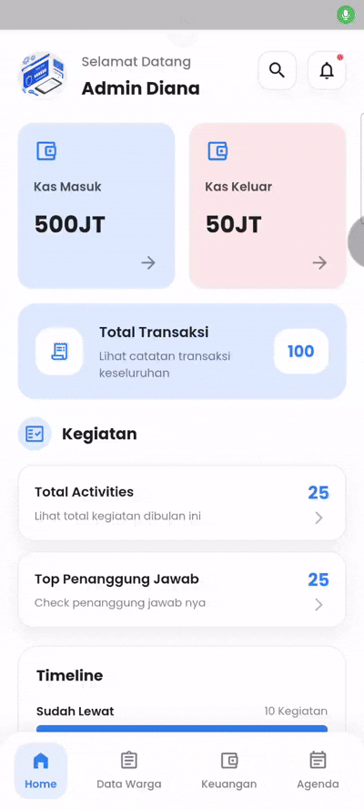
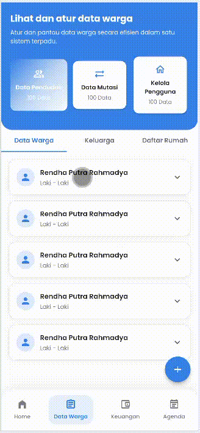
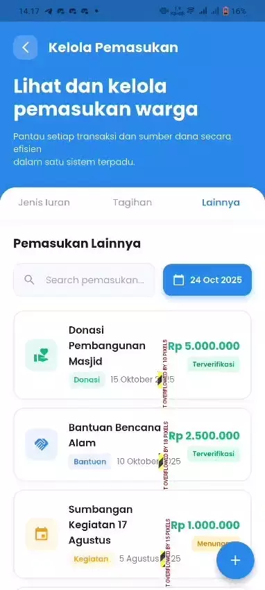

# 🏘️ Jawara - Aplikasi Manajemen Kampung Digital

Jawara adalah aplikasi manajemen kampung digital yang dirancang untuk memudahkan administrasi dan komunikasi antara admin kampung dengan warga. Aplikasi ini menyediakan berbagai fitur untuk mengelola data warga, kegiatan kampung, keuangan, dan pesan dari warga.

---

## 📱 Fitur Utama

### 🔐 Autentikasi

- **Splash Screen** - Tampilan pembuka aplikasi
- **Onboarding** - Pengenalan fitur aplikasi
- **Pre-Auth** - Layar sebelum autentikasi
- **Login & Register** - Sistem autentikasi pengguna

### 📊 Dashboard

- **Overview Keuangan** - Monitoring pemasukan dan pengeluaran kampung
- **Total Aktivitas** - Melihat kegiatan bulan ini dengan detail per tanggal
- **Top Penanggung Jawab** - Daftar penanggung jawab kegiatan
- **Timeline Kegiatan** - Visualisasi jadwal kegiatan
- **Grafik Performa** - Statistik kategori kegiatan
- **Aktivitas Bulanan** - Laporan kegiatan per bulan

### 👥 Data Warga

- **Data Penduduk** - Manajemen database warga kampung
- **Profil Lengkap** - Informasi detail setiap warga
- **Pencarian & Filter** - Cari warga dengan mudah

### 📬 Notifikasi & Pesan

- **Notifikasi Pop-up** - Alert pesan masuk dari warga
- **Pesan dari Warga** - Inbox pesan dengan status:
  - 🕐 Pending
  - ✅ Diterima
  - ❌ Ditolak
- **Search & Filter** - Cari pesan dengan mudah

### 📅 Detail Kegiatan

- **Kalender Kegiatan** - Navigasi per tanggal
- **Daftar Kegiatan** - Detail waktu, jenis, dan status kegiatan
- **Status Tracking** - Monitor progress kegiatan (selesai/pending)

---

## 🛠️ Teknologi yang Digunakan

- **Framework**: Flutter 3.x
- **Language**: Dart
- **Font**: Google Fonts (Poppins)
- **State Management**: StatefulWidget
- **UI Components**: Material Design
- **Package Manager**: pub.dev

---

## 👨‍💻 Tim Pengembang

<<<<<<< HEAD
| No  | Nama                   | Pengerjaan                                                                                               |
| --- |------------------------|----------------------------------------------------------------------------------------------------------|
| 1   | Ahmad Naufal Ilham     | 

View Demo

                                  |
| 2   | Diana Rahmawati        | 

View Demo

                                  |
| 3   | Aryo Adi Putro         | 

View Demo

                 |
| 4   | Petrus Tyang A.R       | 

View Demo

             |
| 5   | Saka Nabil             | 

View Demo

 |
| 6   | Vidi Joshubzky Saviola | 

View Demo

      |

>>>>>>> origin/master

---

## 🎨 Design System

### Color Palette

- **Primary Blue**: `#2F80ED`
- **Background**: `#FFFFFF`
- **Text Primary**: `#1F1F1F`
- **Text Secondary**: `#7A7C89`
- **Border**: `#E8EAF2`
- **Success**: `#27AE60`
- **Error**: `#EB5757`

### Typography

- **Font Family**: Poppins
- **Heading**: 18-20px, Bold (700)
- **Subheading**: 14-16px, SemiBold (600)
- **Body**: 12-14px, Regular (400)

---

## LINK FIGMA
- https://www.figma.com/design/vvW09bovdPxhaPT09Lm97K/PBL-MOBILE-19-10-2025?node-id=636-4927&t=uwfG3dQnupb324SV-1

  
Made with ❤️ by Kelompok 3

  
© 2025 Jawara. All rights reserved.

